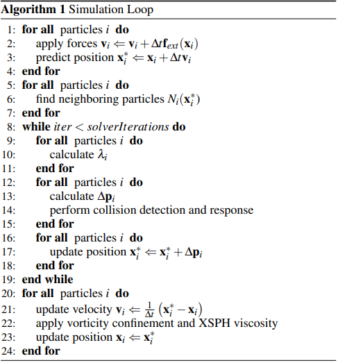
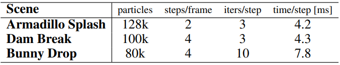
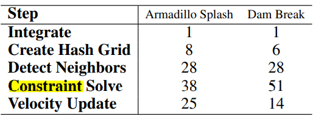

To appear in ACM TOG 32(4).

# Position Based Fluids(PBF)

Miles Macklin   e-mail:mmacklin@nvidia.com

Matthias Muller   e-mail:mathiam@nvidia.com

**NVIDIA**

## 摘要（Abstract）

​		在流体模拟中，增强不可压缩性对于真实感至关重要；它的计算也非常复杂。最近的一些成果提高了计算的效率，但仍然需要迭代时间步长，这对于实时应用程序来说是不切实际的。在本文章中，我们提出了一个集成到**基于位置的动力学框架**（PBD）的迭代密度解算器。通过制定和解决一组实施恒定密度的位置约束，我们的方法允许类似于现代平滑粒子流体动力学（SPH）解算器的不可压缩性和收敛性，而且继承了几何、基于位置的动力学方法的稳定性，允许大时间步长适用于实时应用。我们加入了一个人工压力项，它可以改善粒子分布，产生表面张力，并降低传统SPH的邻域要求。最后，我们通过将涡度约束作为速度后处理来解决能量损失问题。

### CR类别

I.3.5 [Computer Graphics]: Computational Geometry and Object Modeling—Physically based modeling I.3.7 [Computer Graphics]: Three-Dimensional Graphics and Realism— Animation;

### 关键词

流体模拟、SPH、PCISPH、约束流体、基于位置的动力学（PBD）

### 注解（部份解释）

文章中的neighbor翻译为邻域，可以理解为寻找某个粒子的相邻粒子，这可能需要遍历所有粒子，计算复杂

## 1 Introduction

​		流体，特别是像水这样的液体，是许多视觉丰富现象的根源，模拟它们一直是计算机图形学中的一个兴趣和挑战。有多种可用的技术，但这里我们重点介绍粒子方法，它们因其简单性和灵活性而流行。

​		平滑粒子流体动力学（SPH）[Monaghan 1992] [1994]是一种著名的基于粒子的流体模拟方法。它有许多吸引人的特性：质量守恒、拉格朗日离散化（特别适用于模拟域不必要事先已知的**游戏**），并且概念较为简单。然而，SPH对邻域缺陷引起的密度波动非常敏感，并且由于模型的非结构化性质，执行不可压缩性的成本很高。最近的一些科研成果将效率提高了一个数量级[Solenthaler and Pajarola，2009]，但仍然需要小的时间步长，从而限制了实时应用。

.png)

(a)  使用**ellipsoid splatting**实时渲染流体曲面

.png)

（b）底层模拟粒子

**图 1**：兔子在洗澡。128k粒子，2个子步骤，每帧3次密度迭代，每帧平均模拟时间10ms

​		对于交互式环境，鲁棒性是一个关键问题：仿真必须优雅地处理退化情况。如果粒子没有足够的邻域进行精确的密度估计，SPH算法通常会变得不稳定。典型的解决方案是通过采取足够小的时间步，或使用足够多的粒子，以增加计算量为代价，尝试避免这些情况。

​		在本文中，我们展示了如何在基于位置的动力学（PBD）框架内模拟不可压缩流[Muller et al.2007]。我们选择PBD是因为它具有无条件稳定的时间积分和健壮性，这使得它受到游戏开发者和电影制作者的欢迎。通过解决自由表面的粒子缺陷问题，并处理较大的密度误差，我们的方法允许用户在保持稳定的同时，以不可压缩性换取性能。

## 2 相关工作（Related Work）

​		Muller[2003]表明，通过使用低刚度状态方程（equation of state EOS），SPH可用于具有粘度和表面张力的交互式流体模拟。然而，为了保持不可压缩性，标准SPH或弱可压缩SPH（WCSPH）[Becker and Teschner 2007]需要刚性方程，从而产生限制时间步长的较大力。预测校正不可压缩SPH（PCISPH）[Solenthaler and Pajarola 2009]通过使用迭代雅可比式方法（累积压力变化并施加力直至收敛）来放松此时间步长限制。它的优点是不需要用户指定的刚度值，并且可以在多个密度上摊销查找邻域的成本

​		Bodin et al[2012]通过将不可压缩性作为速度约束系统来实现均匀密度流体。他们利用线性化的约束函数构造了一个线性互补问题，并用Gauss-Seidel iteration求解。相比之下，我们的方法（以及 PCISPH）试图通过直接对粒子进行操作来解决非线性问题，并在每次Jacobi迭代中重新评估约束误差和梯度。

​		混合方法，如流体隐式粒子（FLIP）[Brackbill and Ruppel 1986]使用网格进行压力求解，并将速度变化传递回粒子。之后，Zhu和Bridson[2005]将FLIP扩展到具有自由表面的不可压缩流动。Ravendran等人[2011]在自适应SPH更新之前，使用粗网格求解近似无散度的速度场。

​		Clavet等人[2005]也使用基于位置的方法来模拟粘弹性流体。然而，由于时间步长出现在其位置投影的不同位置，因此其方法仅与常规显式积分一样具有条件稳定性。

​		基于位置的动力学[Muller et al.2007¨]提供了一种基于Verlet集成的游戏动力学模拟方法。它通过直接更新粒子位置，利用Gauss-Seidel iteration求解非线性约束系统。通过避开力，并从位置更新中隐式导出动量变化，避免了与显式方法相关的典型不稳定性

## 3 强制不可压缩性（Enforcing Incompressibility）

​		为了实现恒定密度，我们求解一个非线性约束系统，每个粒子有一个约束。每个约束都是粒子位置及其相邻位置的函数，我们统称为p1、…、pn。以下[Bodin et al，2012]使用状态方程定义了第i个粒子上的密度约束：
$$
C_i(p_1,...,p_n)=\frac{\rho_i}{\rho_0}-1\tag{1}
$$
​		其中ρ0是静止密度，ρi由标准SPH密度估计器给出：
$$
\rho_i=\sum_j m_jW(p_i-p_j,h)\tag{2}
$$
​		我们将所有粒子视为质量相等，并将从后续方程中删除该项。在我们的实现中，我们使用Poly6核进行密度估计，使用Spiky核进行梯度计算，如[Muller et al.2003]。

​		现在我们给出一些基于位置的动力学方法的背景知识，然后展示如何结合我们的密度约束。PBD旨在找到粒子位置偏移∆p满足约束条件的p：
$$
C(p+\triangle p)=0\tag{3}
$$
这可以通过沿约束梯度的一系列牛顿步来发现：
$$
\triangle p\approx \gradient C(p)\lambda\tag{4}
$$

$$
C(p+\triangle p)\approx C(p)+\gradient C^T\triangle p=0\tag{5}
$$

$$
C(p+\triangle p)\approx C(p)+\gradient C^T \gradient C \lambda=0\tag{6}
$$

**step1(1-4)：遍历所有粒子，更新速度和位置**

**step2(4,7)：遍历所有粒子，找到相邻粒子**

**step3(8,19)：迭代求出位置偏移量并将其应用于当前位置**

**step4(20,24)：遍历所有粒子，利用偏移后的位置求出速度，然后更新位置**

[Monaghan 1992]给出了粒子上定义的函数梯度的SPH公式。应用该方法，约束函数（1）相对于粒子k的梯度由以下公式给出：
$$
\gradient_{Pk}C_i = \frac{1}{\rho_0}\sum_j\gradient_{Pk}W(p_i-p_j,h)\tag{7}
$$

根据k是否为相邻粒子，有两种不同的情况：
$$
\gradient_{Pk}C_i=\frac{1}{\rho}
\left\{\begin{matrix}\sum_j\gradient_{Pk}W(p_i-p_j,h),&if&k=i\\
-\gradient_{Pk}W(p_i-p_j,h),&if&k=j \end{matrix}\right.\tag{8}
$$
将其插入（6）并求解λ给出
$$
\lambda_i = -\frac{C_i(p_1,...,p_n)}{\sum _k|\gradient_{Pk}C_i|^2}\tag{9}
$$
这对于约束中的所有粒子都是相同的。

​		由于约束函数（1）是非线性的，在平滑核边界处梯度会消失，因此当粒子接近分离时，方程（9）中的分母会导致不稳定性。正如在PCISPH中一样，这可以通过预先计算基于填充邻域的参考粒子配置的保守校正尺度来解决。

​		或者，约束力混合（CFM）[Smith 2006]可用于正则化约束。CFM背后的想法是通过将一些约束力混合回约束函数来软化约束，在PBD的情况下，这将（6）更改为
$$
C(p+\triangle p)\approx C(p)+\gradient C^T \gradient C \lambda + \epsilon\lambda\tag{10}
$$
其中ε是用户指定的松弛参数，在模拟过程中保持不变。比例因子现在为
$$
\lambda_i = -\frac{C_i(p_1,...,p_n)}{\sum _k|\gradient_{Pk}C_i|^2+\epsilon}\tag{11}
$$
而且总位置更新∆p~i~包括来自相邻粒子密度约束（λ~j~）的修正
$$
\triangle p_i = \frac{1}{\rho_0}\sum_j(\lambda_j+\lambda_j)\gradient W(p_i-p_j,h)\tag{12}
$$

**图 2**

犰狳飞溅，Top：由于相邻缺陷导致的颗粒聚集，Bottom：使用人工压力项，注意改进的颗粒分布和表面张力。

## 4 拉伸不稳定性（Tensile Instability）

​		SPH模拟中的一个常见问题是，当粒子只有几个相邻粒子且无法满足静止密度时，由负压引起的粒子聚集或结块（图2）。这可以通过将夹紧压力设置为非负压力来避免，但代价是降低颗粒内聚力。Clavet等人[2005]使用了第二个“近压力”项，而Alduan和Otaduy[2011]使用离散元（DEM）力[Bell等人2005]将粒子推离平滑内核宽度的一半以上。Schechter和Bridson[2012]在自由表面周围放置幽灵粒子（ghost particles），以确保一致的密度估计。

​		我们遵循[Monaghan 2000]的方法，该方法添加了一个人工压力，该压力根据平滑内核本身指定为
$$
s_{corr}=-k(\frac{W(p_i-p_j,h)}{W(\triangle q,h)})^n\tag{13}
$$
​		式中，∆q是平滑核半径内某个固定距离的点，k是一个小的正常数（small positive constant）|∆q |=0.1h···0.3h，k=0.1和n=4工作良好。然后，我们在粒子位置更新中包括该项，如下所示：
$$
\triangle p_i=\frac{1}{\rho_0}\sum_j(\lambda_i+\lambda_j+s_{corr})\gradient W(p_i-p_j,h)\tag{14}
$$
​		这个纯排斥项使粒子密度略低于其他密度。因此，粒子将其相邻粒子向内拉，产生类似于[Clavet et al.2005]中所述的表面张力效应。我们注意到，这种效应是反聚集项的非物理产物，需要在聚集误差和表面张力强度之间进行权衡

​		在没有聚集问题的情况下，我们的算法不受SPH中粒子必须始终有30-40个邻居的经验法则的影响，从而提高了效率

## 5 涡度约束与粘度（Vorticity Confinement and Viscosity）

​		基于位置的方法引入了额外的阻尼，这是不可取的。Fedkiw等人[2001]在计算机图形学中引入了涡度限制，以解决烟雾模拟中的数值耗散问题，后来在[Lentine等人2011]中扩展到了节能流体模拟。Hong等人[2008]展示了如何在混合装置中使用涡度限制，其中涡度从网格转移到SPH粒子，以引入湍流运动。

​		我们可以选择使用涡度限制来代替损失的能量（图5）。这需要首先计算粒子位置的涡度，我们使用[Monaghan 1992]中给出的估计器：
$$
\omega_i = \gradient \cross v = \sum_j v_{i,j}\cross \gradient_{pj}W(p_i-p_j,h)\tag{15}
$$
其中v~ij~=v~j~−v~i~， 一旦我们有了涡度，我们就可以使用位置向量N=η/|η|和η=∇|ω|~i~计算矫正力
$$
f_i^{vorticity} = \epsilon (N\cross \omega_i)\tag{16}
$$
与[Hong et al.2008]不同，我们不使用标准化ω，因为这会不加区别地增加涡度。相反，我们使用非标准化值，这只会增加已经存在的涡度，如[Fedkiw et al.2001]。

此外，我们应用了XSPH粘度[Schechter和Bridson 2012]，这对相干运动（coherent motion）很重要。在我们的模拟中，参数c通常选择为0.01：
$$
v_i^{new} =v_i + c\sum_j v_{ij}\cdot W(p_i-p_j,h)\tag{17}
$$

## 6 算法

​		算法1概述了我们的模拟循环。它类似于原始的基于位置的动力学更新，不同之处在于每个约束都以Jacobi方式独立求解，而不是通过顺序Gauss-Seidel迭代。作为约束求解循环的一部分，我们对实体执行碰撞检测。

​		我们每一步重新计算一次粒子邻域，并在每次解算器迭代中重新计算距离和约束值。这种优化可能导致密度不足，例如，如果粒子从初始邻居集中分离。在PCISPH中，这可能会导致严重的问题，一旦粒子变得孤立，每次迭代都会使其压力越来越负。如果它在随后的迭代中再次接触，则会施加较大的错误压力。我们的算法只考虑当前粒子位置（而不是累积压力），因此不会发生这种情况。

**图 3**：将液体兔子滴入水池（80k颗粒）。

**图 4**：兔子下落模拟上的密度。我们的算法保持了与PCISPH相似的压缩性，时间步长是PCISPH的两倍以上。Color key：蓝色，rest density。红色，PCISPH。绿色，我们的方法。

## 7 渲染（Rendering）

​		使用基于GPU的椭球飞溅技术（ellipsoid splatting）执行实时流体表面处理。首先使用Yu和Turk[2013]的方法计算粒子各向异性，然后使用[van der Laan et al.2009]中提出的基于屏幕空间滤波的方法重建表面。

## 8 结果 （Results）

​		我们通过将一只液体兔子滴入水池（图3）来测试我们的算法，并将我们的结果与PCISPH实现进行比较。对于这种情况，PCISPH不稳定，每帧少于10个子步(∆t=0.0016s）。相比之下，我们的算法是稳定的，只需一步(∆t=0.016s）。

​		为了比较压缩性，我们使用10个子步骤和4个压力迭代运行PCISPH，我们的算法使用4个子步骤和每个子步骤10个迭代，因此每个子步骤和每个子步骤总共执行40个压力迭代。这种比较的目的在于表明，我们的方法可以在更大的时间步长下获得相近的结果，允许我们在更多密度迭代中分摊网格构建和邻居查找的每一步成本。

​		我们的结果是一致的，模拟的密度图证实，尽管我们的方法有较大的时间步长，但压缩水平是相似的（图4）。表1和表2总结了我们的算法在一系列场景中的性能

​		因为我们对具有可预测性能的实时应用程序感兴趣，所以我们将迭代次数设置为固定值（通常为2-4），而不是求解特定的错误阈值。然而，我们也在图6中展示了我们的方法在多次迭代中的收敛性。

​		我们在CUDA中实现了我们的算法，并在NVIDIA GTX 680上运行了我们的仿真。我们算法的每个阶段都是完全可并行的，因此我们能够利用并行架构（如GPU）。对于相邻粒子查找，我们使用[Green 2008]的方法。我们还在GPU上执行粒子-固体碰撞检测，其中我们使用有向距离场[Bridson et al.2006]存储为体积纹理。

## 9 局限性和今后的工作（ Limitations and Future Work）

​		当颗粒与固体接触时，由于密度估计不正确，有时会发生沿边界的颗粒堆积。Akinci等人[2012]最近的工作将有助于解决这一问题。

​		雅可比方法在每次迭代中只在粒子的近邻之间传播信息（在我们的例子中是位置修正）。随着粒子数的增加，这可能导致收敛速度变慢。更复杂的并行解算器（如红黑解算器）或多尺度方案（如[Solenthaler and Gross 2011]）应有助于提高收敛速度。

​		由于我们的人工压力项依赖于空间分辨率和时间步长，因此很难独立调整参数。解耦这些参数并使反聚簇独立于表面张力效应将是未来的重要工作。

​		基于位置的动力学常用于模拟布料等可变形对象。我们已经原型化了基于位置的布料和流体之间的双向相互作用，并取得了令人满意的结果。

**表格 1**：几个示例的性能结果。所有情况下都使用16ms的帧时间。

**表格2**：两个示例的框架分解（百分比）。约束求解包括与静态对象的碰撞处理，速度更新包括涡度约束和粘度计算。

## 10 致谢（ Acknowledgments）

​		作者要感谢NVIDIA支持我们的研究，特别是Nuttapong Chentanez、Tae Yong Kim和Simon Schirm的宝贵反馈，Simon Green的渲染工作，Adam Moravanszky和Christian Sigg的鼓励。我们还要感谢匿名评论员的慷慨评论和建议。兔子和犰狳模型由斯坦福计算机图形学实验室提供。

**图 5**：t=6.0时的溃坝场景，左侧：涡度限制禁用。右图：涡度限制启用，请注意明显较高的飞溅。

**图 6**：在溃坝情况下，我们的方法在t=1.0的多次迭代中的收敛性。

## References

AKINCI, N., IHMSEN, M., AKINCI, G., SOLENTHALER, B., AND TESCHNER, M. 2012. Versatile rigid-fluid coupling for incompressible sph. ACM Trans. Graph. 31, 4 (July), 62:1–62:8. ALDUAN´ , I., AND OTADUY, M. A. 2011. Sph granular flow with friction and cohesion. In Proceedings of the 2011 ACM SIGGRAPH/Eurographics Symposium on Computer Animation, ACM, New York, NY, USA, SCA ’11, 25–32. BECKER, M., AND TESCHNER, M. 2007. Weakly compressible sph for free surface flows. In Proceedings of the 2007 ACM SIGGRAPH/Eurographics symposium on Computer animation, Eurographics Association, Aire-la-Ville, Switzerland, Switzerland, SCA ’07, 209–217. BELL, N., YU, Y., AND MUCHA, P. J. 2005. Particle-based simulation of granular materials. In Proceedings of the 2005 ACM SIGGRAPH/Eurographics symposium on Computer animation, ACM, New York, NY, USA, SCA ’05, 77–86. BODIN, K., LACOURSIERE, C., AND SERVIN, M. 2012. Constraint fluids. IEEE Transactions on Visualization and Computer Graphics 18, 3 (Mar.), 516–526. BRACKBILL, J. U., AND RUPPEL, H. M. 1986. Flip: A method for adaptively zoned, particle-in-cell calculations of fluid flows in two dimensions. J. Comput. Phys. 65, 2 (Aug.), 314–343. BRIDSON, R., FEDKIW, R., AND MULLER ¨ -FISCHER, M. 2006. Fluid simulation: Siggraph 2006 course notes fedkiw and muller-fischer presenation videos are available from the citation page. In ACM SIGGRAPH 2006 Courses, ACM, New York, NY, USA, SIGGRAPH ’06, 1–87. CLAVET, S., BEAUDOIN, P., AND POULIN, P. 2005. Particlebased viscoelastic fluid simulation. In Proceedings of the 2005 ACM SIGGRAPH/Eurographics symposium on Computer animation, ACM, New York, NY, USA, SCA ’05, 219–228. FEDKIW, R., STAM, J., AND JENSEN, H. W. 2001. Visual simulation of smoke. In Proceedings of the 28th annual conference on Computer graphics and interactive techniques, ACM, New York, NY, USA, SIGGRAPH ’01, 15–22. GREEN, S. 2008. Cuda particles. nVidia Whitepaper 2, 3.2, 1. HONG, J.-M., LEE, H.-Y., YOON, J.-C., AND KIM, C.-H. 2008. Bubbles alive. In ACM SIGGRAPH 2008 papers, ACM, New York, NY, USA, SIGGRAPH ’08, 48:1–48:4. LENTINE, M., AANJANEYA, M., AND FEDKIW, R. 2011. Mass and momentum conservation for fluid simulation. In Proceedings of the 2011 ACM SIGGRAPH/Eurographics Symposium on Computer Animation, ACM, New York, NY, USA, SCA ’11, 91– 100. MONAGHAN, J. J. 1992. Smoothed particle hydrodynamics. Annual Review of Astronomy and Astrophysics 30, 1, 543–574. MONAGHAN, J. J. 1994. Simulating free surface flows with sph. J. Comput. Phys. 110, 2 (Feb.), 399–406. MONAGHAN, J. J. 2000. Sph without a tensile instability. J. Comput. Phys. 159, 2 (Apr.), 290–311. MULLER ¨ , M., CHARYPAR, D., AND GROSS, M. 2003. Particlebased fluid simulation for interactive applications. In Proceedings of the 2003 ACM SIGGRAPH/Eurographics symposium on Computer animation, Eurographics Association, Aire-la-Ville, Switzerland, Switzerland, SCA ’03, 154–159. MULLER ¨ , M., HEIDELBERGER, B., HENNIX, M., AND RATCLIFF, J. 2007. Position based dynamics. J. Vis. Comun. Image Represent. 18, 2 (Apr.), 109–118. RAVEENDRAN, K., WOJTAN, C., AND TURK, G. 2011. Hybrid smoothed particle hydrodynamics. In Proceedings of the 2011 ACM SIGGRAPH/Eurographics Symposium on Computer Animation, ACM, New York, NY, USA, SCA ’11, 33–42. SCHECHTER, H., AND BRIDSON, R. 2012. Ghost sph for animating water. ACM Trans. Graph. 31, 4 (July), 61:1–61:8. SMITH, R. 2006. Open dynamics engine v0.5 user guide. SOLENTHALER, B., AND GROSS, M. 2011. Two-scale particle simulation. ACM Trans. Graph. 30, 4 (July), 81:1–81:8. SOLENTHALER, B., AND PAJAROLA, R. 2009. Predictivecorrective incompressible sph. In ACM SIGGRAPH 2009 papers, ACM, New York, NY, USA, SIGGRAPH ’09, 40:1–40:6. VAN DER LAAN, W. J., GREEN, S., AND SAINZ, M. 2009. Screen space fluid rendering with curvature flow. In Proceedings of the 2009 symposium on Interactive 3D graphics and games, ACM, New York, NY, USA, I3D ’09, 91–98. YU, J., AND TURK, G. 2013. Reconstructing surfaces of particlebased fluids using anisotropic kernels. ACM Trans. Graph. 32, 1 (Feb.), 5:1–5:12. ZHU, Y., AND BRIDSON, R. 2005. Animating sand as a fluid. In ACM SIGGRAPH 2005 Papers, ACM, New York, NY, USA, SIGGRAPH ’05, 965–972.
